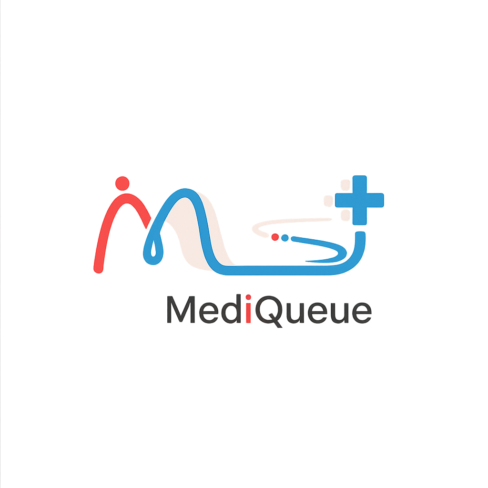

<div align="center">
<a href="https://git.io/typing-svg"></a>
</div>


#  MediQueue - Sistema de Gestión de Turnos Médicos

MediQueue es una plataforma moderna de gestión de turnos médicos que conecta pacientes y profesionales de la salud para optimizar la atención médica y mejorar la experiencia del paciente en un entorno digital colaborativo.

##

##  Acerca del Proyecto 

MediQueue nace de la necesidad de modernizar la gestión de turnos médicos, siguiendo los estándares de calidad en atención sanitaria según los ODS 3. Nuestra plataforma ofrece un espacio donde pacientes, médicos y administradores pueden:

- 🏥 Gestionar turnos médicos de múltiples especialidades
- 👩‍⚕️ Acceder a un sistema intuitivo de reservas online
- 📊 Monitorear estadísticas y métricas en tiempo real
- 🔒 Mantener la privacidad de datos médicos con políticas GDPR
- 📱 Disfrutar de una experiencia responsive y moderna
- ⚡ Optimizar los tiempos de espera y flujo de pacientes

##

## <p align="left"> Tecnologías Utilizadas</p>

### <p align="center">Frontend</p>
<p align="center">
  <a href="">
    
  </a>
</p>

### <p align="center">Backend</p>
<p align="center">
  <a href="">
    
  </a>
</p>

### <p align="center">Base de Datos</p>
<p align="center">
  <a href="">
    
  </a>
</p>

##  Características Principales

|  Características  | Descripción |
| --- | --- |
| 📅 **Gestión de Turnos** | Sistema completo de reserva y administración de citas médicas |
| 🏥 **Múltiples Especialidades** | Soporte para pediatría, cardiología, traumatología, nutrición y más |
| 👤 **Panel Administrativo** | Dashboard moderno con métricas y estadísticas en tiempo real |
| 🔐 **Sistema de Autenticación** | Login seguro para pacientes y personal médico |
| 🍪 **Gestión de Privacidad** | Sistema completo de cookies y políticas de privacidad GDPR |
| 📱 **Diseño Responsive** | Experiencia optimizada en todos los dispositivos |
| ⚡ **Carga Rápida** | Interfaz moderna con componentes optimizados |
| 🔔 **Notificaciones** | Sistema de alertas y recordatorios para pacientes |

##

##  Capturas de Pantalla

<table>
  <tr>
    <td align="center"><br /><b>Página Principal</b></td>
    <td align="center"><br /><b>Panel Administrativo</b></td>
  </tr>
  <tr>
    <td align="center"><br /><b>Sistema de Turnos</b></td>
    <td align="center"><br /><b>Perfil de Paciente</b></td>
  </tr>
</table>

##  Comenzando  

### Frontend

```bash
# Clonar el repositorio:
git clone https://github.com/tu-usuario/MediQueue.git

# Navegar al directorio del proyecto:
cd MediQueue/MediQueue

# Instalar dependencias:
npm install

# Iniciar el servidor de desarrollo:
npm run dev
```

### Backend

```bash
# Navegar al directorio del backend:
cd MediQueue-Backend

# Instalar dependencias:
npm install

# Configurar variables de entorno:
cp .env.example .env
# Editar .env con tus configuraciones de base de datos

# Inicializar la base de datos:
node init-db.js

# Iniciar el servidor:
npm start
```

### Requisitos Previos

[](https://nodejs.org/en/download)
[](https://dev.mysql.com/downloads/)

```python 
# Descarga la versión apropiada de Node.js para tu sistema operativo
# Instala MySQL y crea una base de datos para MediQueue
# Configura las variables de entorno en el archivo .env

# Comando para ejecutar el proyecto completo:
npm run dev (Frontend)
npm start (Backend)
```

##  Especialidades Médicas Disponibles

- 🩺 **Medicina General** - Consultas de atención primaria
- ❤️ **Cardiología** - Especialista en enfermedades del corazón
- 🦴 **Traumatología** - Tratamiento de lesiones y fracturas
- 👶 **Pediatría** - Atención médica infantil especializada
- 👁️ **Oftalmología** - Cuidado de la salud visual
- 🥗 **Nutrición** - Asesoramiento nutricional profesional

##  Licencia
  [](https://github.com/tu-usuario/MediQueue/blob/main/LICENSE)

##

##   Equipo de Desarrollo

<table>
  <tr>
    <td align="center">
      <a href="https://github.com/tu-usuario">
        
        <br />
        <sub><b>Tu Nombre</b></sub>
      </a>
      <br />
      <a href="#" title="Code">💻</a>
      <a href="#" title="Design">🎨</a>
      <a href="#" title="Medical">⚕️</a>
    </td>
    <!-- Agregar más miembros del equipo según sea necesario -->
  </tr>
</table>

##

##   Contacto

📢 ¡Conectemos! Si eres profesional de la salud, desarrollador interesado en healthcare tech, o simplemente quieres mejorar la experiencia de atención médica, estamos emocionados de colaborar contigo. ¿Tienes ideas para mejorar MediQueue? ¡Hablemos! 

<p align="center">
  
[](https://github.com/tu-usuario)  [](https://linkedin.com/in/tu-perfil)  [](mailto:tu-email@gmail.com)  [](https://wa.me/tu-numero)

##

##  ¡Disfruta de MediQueue! 

###  ¿Te gustó nuestro trabajo?

 [Dale una estrella a este proyecto](https://github.com/tu-usuario/MediQueue)<br/>
 [Síguenos en GitHub](https://github.com/tu-usuario)<br/>
 [Invítanos un café](https://ko-fi.com/tu-usuario) 

##

<p align="center">
  <a href="https://github.com/tu-usuario/MediQueue/stargazers">
    
  </a>
  <a href="https://github.com/tu-usuario/MediQueue/network/members">
    
  </a>
  <a href="https://github.com/tu-usuario/MediQueue/issues">
    
  </a>
  
</p>

</p>

<div align="center">
  
</div>