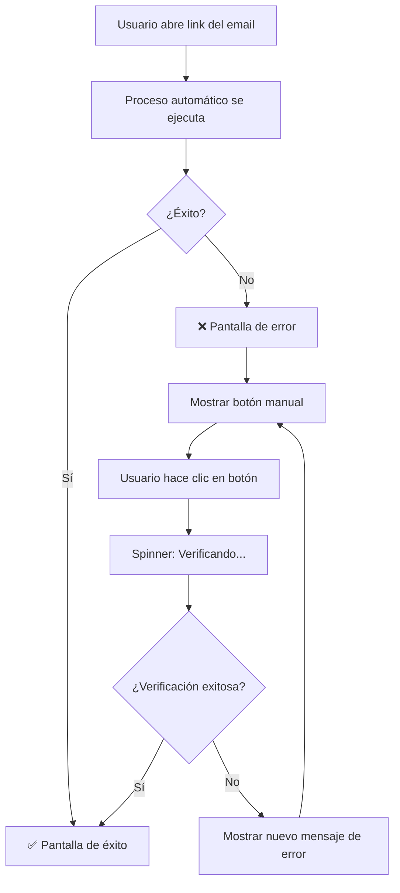

# 🔄 Botón de Verificación Manual en la UI

## 📋 ¿Qué se implementó?

Se agregó un **botón de verificación manual** en la página de verificación de email (`EmailVerification.jsx`) que permite a los usuarios intentar verificar su email manualmente si el proceso automático falla.

---

## ✨ Funcionalidad Implementada

### 1. **Botón "Verificar Manualmente"**

Cuando el proceso automático de verificación falla, ahora se muestra:
- ✅ Un mensaje explicativo
- ✅ Un botón **"🔄 Verificar Manualmente"**
- ✅ Spinner animado mientras se procesa
- ✅ Feedback visual del resultado

### 2. **Comportamiento del Botón**

**Se muestra SOLO cuando:**
- ❌ El proceso automático falló
- ❌ El error NO es "token no válido"
- ❌ El error NO es "ya verificado anteriormente"

**No se muestra cuando:**
- ✅ El email ya fue verificado exitosamente
- ✅ No hay token en la URL
- ✅ El enlace ya fue usado previamente

---

## 🎨 Interfaz Visual

### Estado de Error con Botón Manual

```
┌─────────────────────────────────────────┐
│         ❌ Error Icon                   │
│                                         │
│    Error en la Verificación            │
│                                         │
│    [Mensaje de error específico]       │
│                                         │
│  ┌───────────────────────────────────┐ │
│  │ ¿El proceso automático falló?     │ │
│  │                                   │ │
│  │ Puedes intentar verificar         │ │
│  │ manualmente haciendo clic:        │ │
│  └───────────────────────────────────┘ │
│                                         │
│  ┌──────────────────────────────────┐  │
│  │  🔄 Verificar Manualmente        │  │
│  └──────────────────────────────────┘  │
│                                         │
│  ┌──────────────────────────────────┐  │
│  │  Volver al Inicio de Sesión      │  │
│  └──────────────────────────────────┘  │
└─────────────────────────────────────────┘
```

### Estado Procesando

```
┌─────────────────────────────────────────┐
│  ┌──────────────────────────────────┐  │
│  │  ⏳ Verificando...               │  │
│  └──────────────────────────────────┘  │
└─────────────────────────────────────────┘
```

---

## 🔧 Flujo de Verificación



---

## 💻 Código Implementado

### Componente React

```jsx
// Estado para controlar el botón
const [isRetrying, setIsRetrying] = useState(false);

// Función de verificación manual
const handleManualVerification = async () => {
  if (!token) return;
  
  setIsRetrying(true);
  
  try {
    const response = await axios.get(`/api/administradores/verify-email/${token}`);
    
    // Actualizar estado a éxito
    setVerificationState({
      loading: false,
      success: true,
      message: response.data.message || 'Email verificado exitosamente',
      error: null
    });
  } catch (error) {
    // Manejar errores...
  } finally {
    setIsRetrying(false);
  }
};
```

### Renderizado del Botón

```jsx
{verificationState.error !== 'NO_TOKEN' && 
 verificationState.error !== 'ALREADY_USED' && (
  <button 
    className="btn-primary"
    onClick={handleManualVerification}
    disabled={isRetrying}
  >
    {isRetrying ? (
      <>
        <span className="btn-spinner"></span>
        Verificando...
      </>
    ) : (
      '🔄 Verificar Manualmente'
    )}
  </button>
)}
```

---

## 🎯 Casos de Uso

### Caso 1: Timeout en Producción

**Problema**: El servidor de Railway tiene latencia alta.

**Solución**: 
1. El proceso automático falla por timeout
2. Se muestra el botón de verificación manual
3. El usuario hace clic
4. El botón reintenta la verificación
5. ✅ Si el servidor responde, se verifica exitosamente

---

### Caso 2: Error Temporal de Base de Datos

**Problema**: La conexión a MySQL se perdió temporalmente.

**Solución**:
1. Primera verificación falla
2. Usuario espera unos segundos
3. Hace clic en "Verificar Manualmente"
4. ✅ La conexión se restableció y la verificación funciona

---

### Caso 3: Token Válido pero Error de Red

**Problema**: Error de red entre frontend y backend.

**Solución**:
1. Verificación automática falla por red
2. Usuario reintenta manualmente
3. ✅ La red se estabilizó y funciona

---

## 🔒 Seguridad

### Validaciones Implementadas

1. ✅ **Solo funciona con token válido**: El botón usa el mismo token de la URL
2. ✅ **No permite múltiples clics**: Se deshabilita mientras procesa
3. ✅ **Misma validación del backend**: Usa el mismo endpoint `/verify-email/:token`
4. ✅ **No expone información sensible**: Solo muestra mensajes seguros

### Protección contra Abuso

- El backend ya valida que el token sea válido
- El backend ya previene verificaciones duplicadas
- El botón solo reintenta, no crea nuevos tokens

---

## 🎨 Estilos CSS

### Sección de Verificación Manual

```css
.manual-verification-section {
  margin: 20px 0;
  padding: 15px;
  background: rgba(74, 144, 164, 0.05);
  border-left: 4px solid #4a90a4;
  border-radius: 4px;
}
```

### Spinner del Botón

```css
.btn-spinner {
  width: 16px;
  height: 16px;
  border: 2px solid rgba(255, 255, 255, 0.3);
  border-top-color: white;
  border-radius: 50%;
  animation: spin 0.8s linear infinite;
}
```

### Botón Deshabilitado

```css
.btn-primary:disabled {
  opacity: 0.7;
  cursor: not-allowed;
}
```

---

## 📱 Responsive

El botón se adapta perfectamente a dispositivos móviles:

- ✅ Tamaño de fuente ajustado
- ✅ Padding reducido en pantallas pequeñas
- ✅ Sección de información compacta
- ✅ Botones apilados verticalmente

---

## 🧪 Pruebas Sugeridas

### Test 1: Verificación Manual Exitosa

1. Abrir link de verificación
2. Si falla automáticamente, hacer clic en "Verificar Manualmente"
3. **Esperado**: Pantalla de éxito ✅

### Test 2: Token Inválido

1. Usar un token falso en la URL
2. **Esperado**: No se muestra el botón manual (solo "Volver")

### Test 3: Email Ya Verificado

1. Abrir link que ya fue usado
2. **Esperado**: Mensaje de "ya verificado" sin botón manual

### Test 4: Múltiples Clics

1. Hacer clic en "Verificar Manualmente"
2. Mientras carga, intentar hacer clic de nuevo
3. **Esperado**: Botón deshabilitado, no permite doble clic

---

## 🔄 Integración con Backend

El botón usa el endpoint existente:

```
GET /api/administradores/verify-email/:token
```

**Respuesta Exitosa (200)**:
```json
{
  "success": true,
  "message": "Email verificado exitosamente",
  "admin": { ... }
}
```

**Respuesta de Error (400/404/410)**:
```json
{
  "success": false,
  "message": "Token inválido o expirado"
}
```

---

## 📊 Ventajas de esta Solución

| Ventaja | Descripción |
|---------|-------------|
| 🎯 **UX Mejorada** | Los usuarios pueden resolver problemas sin soporte |
| ⚡ **Sin cambios en backend** | Usa endpoints existentes |
| 🔒 **Seguro** | Mismas validaciones que proceso automático |
| 📱 **Responsive** | Funciona en todos los dispositivos |
| 🎨 **Consistente** | Usa el mismo diseño visual |
| 🐛 **Debugging** | Logs en consola para diagnóstico |

---

## 🚀 Deployment

### Frontend (Vercel/Railway)

Los cambios están en:
- ✅ `src/pages/EmailVerification.jsx`
- ✅ `src/styles/EmailVerification.css`

**Para desplegar**:
```bash
cd MediQueue
git add .
git commit -m "feat: agregar botón de verificación manual de email"
git push origin main
```

El deployment en Vercel se ejecutará automáticamente.

---

## 🔍 Logs y Debugging

El botón incluye logs detallados:

```javascript
console.log('🔄 Intentando verificación manual con token:', token);
console.log('✅ Verificación manual exitosa:', response.data);
console.error('❌ Error en verificación manual:', { status, message });
```

Útil para diagnóstico en producción mediante DevTools del navegador.

---

## 📝 Notas Importantes

1. ⚠️ **El botón NO reemplaza la verificación automática**: Solo es un fallback
2. ⚠️ **El token sigue siendo de un solo uso**: Una vez verificado, no se puede volver a usar
3. ⚠️ **Los tokens expiran en 24 horas**: Después de eso, ni el botón funcionará
4. ✅ **Compatible con todos los navegadores modernos**: Chrome, Firefox, Safari, Edge

---

## 🎉 Resultado Final

Ahora los usuarios tienen una **experiencia mejorada** cuando el proceso automático falla:

1. ✅ Ven claramente qué pasó
2. ✅ Tienen una acción clara para resolver el problema
3. ✅ No necesitan contactar soporte
4. ✅ Feedback visual inmediato
5. ✅ Proceso simple y seguro

---

**Última actualización**: Noviembre 2025
